# 🧠 Mastermind Web Game

Implementação full-stack do clássico jogo de quebra de código **Mastermind**, desenvolvido como case técnico para a vaga de **Engenheiro de Software Full-Stack Jr** no Itaú.

O jogador deve descobrir um código secreto de 4 cores em até 10 tentativas, recebendo feedback lógico a cada palpite — pinos pretos (cor e posição corretas) e pinos brancos (cor certa, posição errada).

---

## Funcionalidades

- **Autenticação completa** — registro, login e logout com sessões via cookie (httponly)
- **Jogo interativo** — seletor de cores visual, timer em tempo real e feedback com pinos
- **Sistema de pontuação** — cálculo baseado em tentativas e tempo (máx. 1000 pontos)
- **Ranking global** — tabela pública com todos os jogadores ordenados por pontuação
- **Histórico pessoal** — todas as partidas do usuário com status, duração e timestamps
- **Dashboard personalizado** — estatísticas do jogador, regras e mini-ranking
- **Abandono de partida** — possibilidade de abandonar jogos em andamento
- **Responsivo** — interface adaptada para desktop e mobile (breakpoint em 600px)

---

## Screenshots

### Autenticação

| Tela | Preview |
|------|---------|
| Login |  |
| Cadastro |  |

### Dashboard

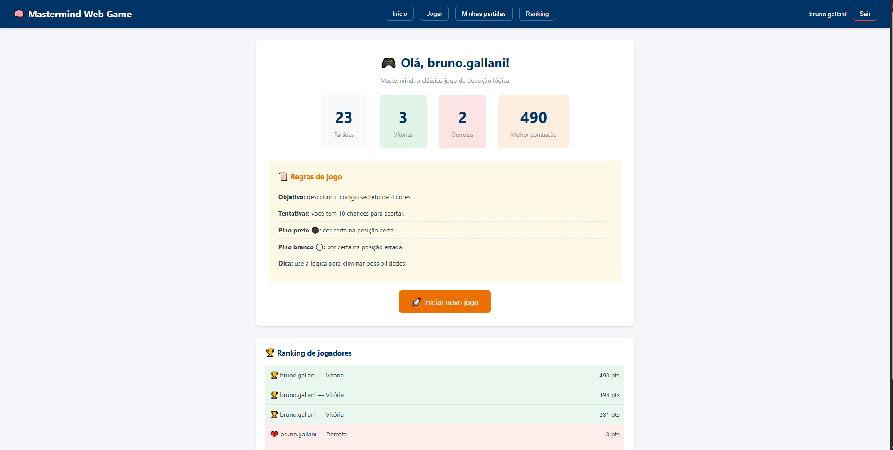

### Jogo

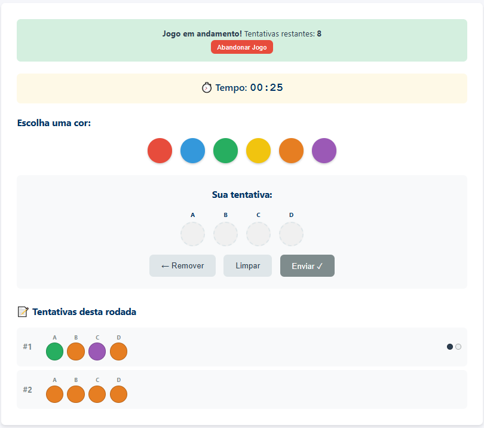


| Momento | Preview |
|---------|---------|
| Selecionando cores | 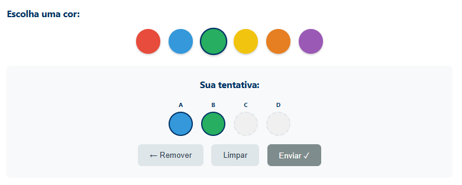 |
| Feedback com pinos |  |
| Vitória | 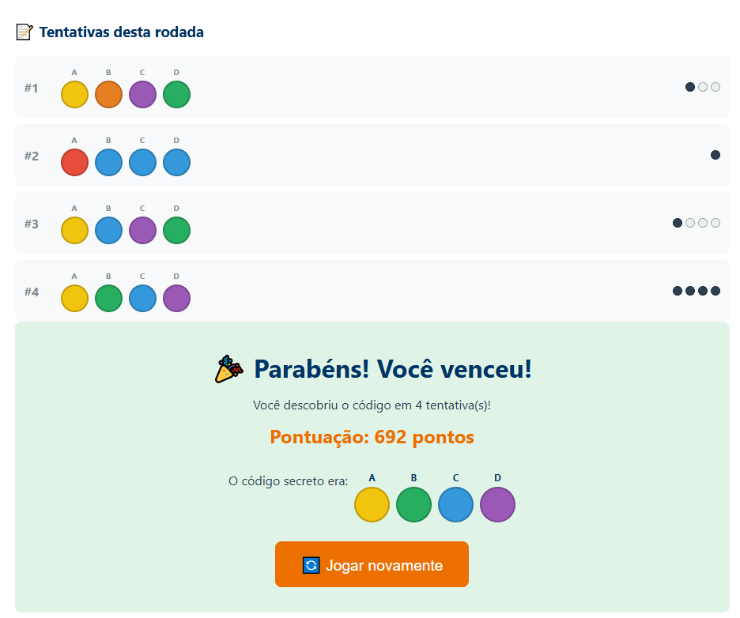 |
| Derrota (código revelado) | 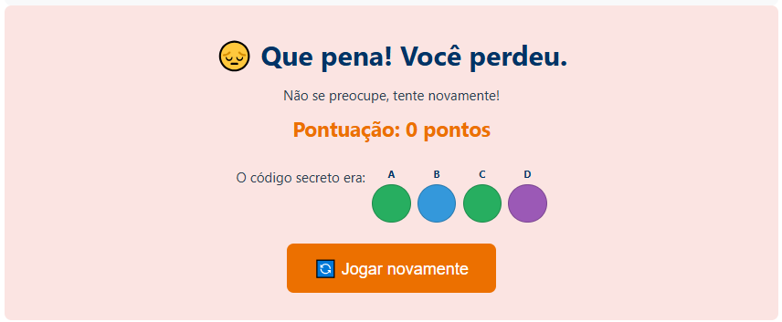 |

### Histórico de Partidas

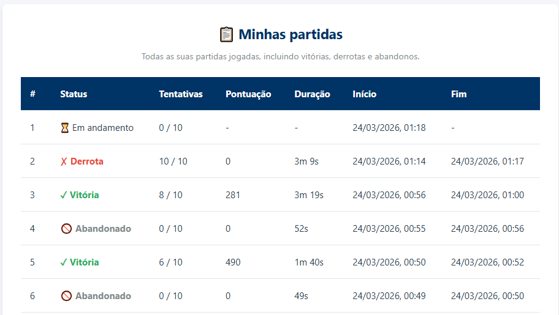

### Ranking global

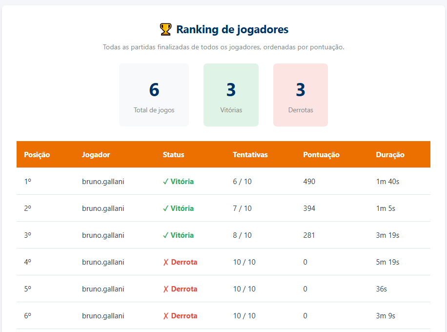

### Responsivo (Mobile)

| Tela | Preview |
|------|---------|
| Dashboard mobile | 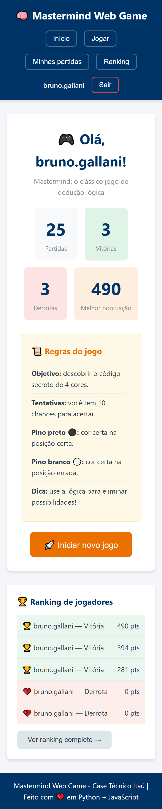 |
| Jogo mobile | 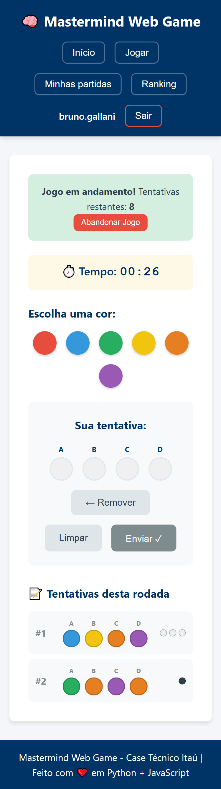 |

### API (Swagger)

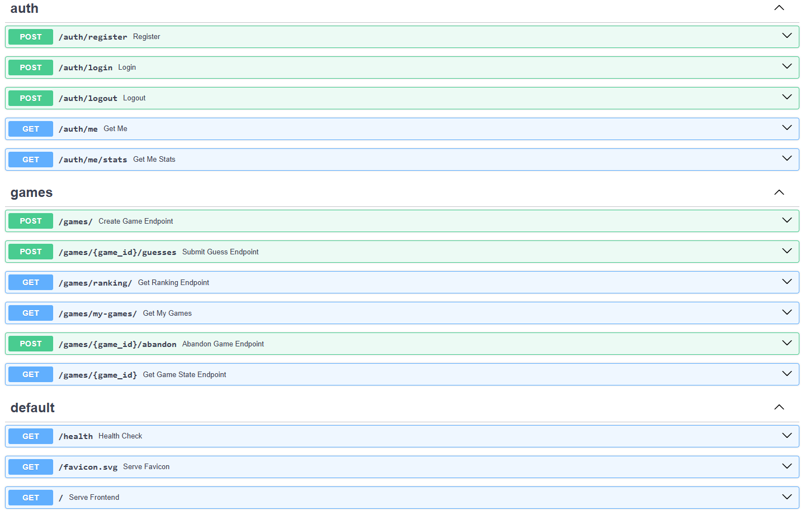

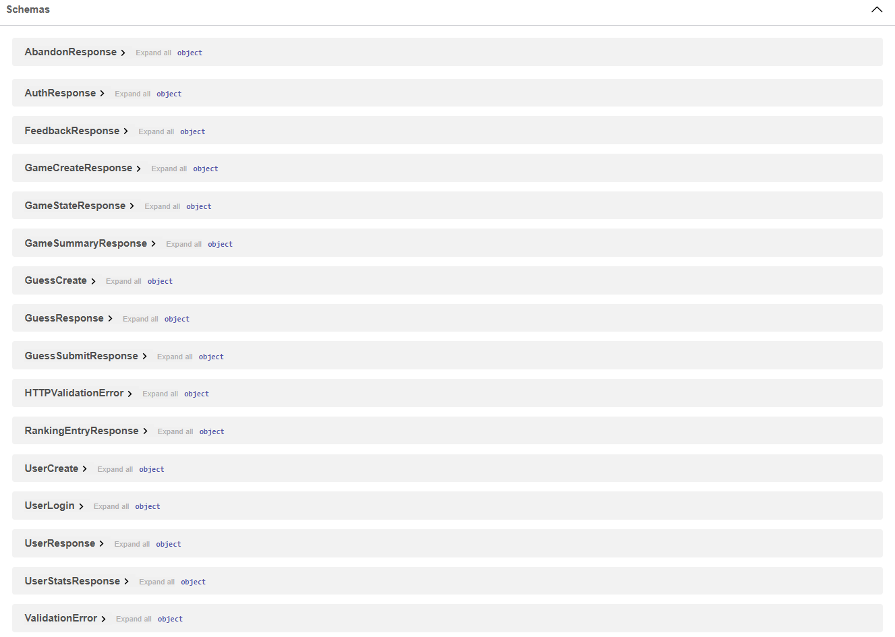

---

## Regras do jogo

- O sistema gera um **código secreto** de 4 cores (de 6 possíveis)
- Cores disponíveis: 🔴 Vermelho, 🔵 Azul, 🟢 Verde, 🟡 Amarelo, 🟠 Laranja, 🟣 Roxo
- Cores **podem se repetir** no código secreto
- O jogador tem **10 tentativas** para adivinhar o código
- Após cada tentativa, o sistema retorna feedback:
  - **Pino preto ⚫** — cor certa na posição certa
  - **Pino branco ⚪** — cor certa na posição errada
- **Vitória**: 4 pinos pretos (código decifrado)
- **Derrota**: 10 tentativas sem acertar
- **Pontuação**: `1000 - (tentativas - 1) × 100 - tempo_em_segundos ÷ 10` (mínimo 0)

---

## Tech Stack

| Camada   | Tecnologia            | Propósito                                |
|----------|-----------------------|------------------------------------------|
| Backend  | Python 3 + FastAPI    | API REST + servidor de arquivos estáticos |
| Frontend | HTML + CSS + JS puro  | Interface do jogo (sem frameworks)        |
| Banco    | SQLite                | Persistência (PostgreSQL via env var)     |
| Testes   | pytest + mini framework JS | Cobertura backend e frontend         |

---

## Quick start

### Pré-requisitos

- Python 3.10+
- pip

### Instalação e execução

```bash
# 1. Clonar o repositório
git clone https://github.com/seu-usuario/mastermind-web-game.git
cd mastermind-web-game

# 2. Criar ambiente virtual (necessário apenas uma vez)
python -m venv venv

# 3. Ativar o ambiente virtual
source venv/bin/activate        # Linux/macOS
venv\Scripts\activate           # Windows

# 4. Instalar dependências
cd backend
pip install -r requirements.txt

# 5. Iniciar o servidor (frontend servido automaticamente)
uvicorn app.main:app --reload --port 8000
```

Acesse:

- **Jogo**: [http://localhost:8000](http://localhost:8000)
- **API Docs (Swagger)**: [http://localhost:8000/docs](http://localhost:8000/docs)

> **Importante:** Não abra `frontend/index.html` diretamente no navegador — a autenticação via cookies requer same-origin (servido pelo FastAPI).

---

## Testes

### Backend

```bash
cd backend

# Todos os testes
python -m pytest app/tests/ -v

# Apenas unitários (lógica do jogo)
python -m pytest app/tests/test_game_logic.py -v

# Integração do jogo
python -m pytest app/tests/test_api.py -v

# Integração de autenticação
python -m pytest app/tests/test_auth.py -v
```

Os testes usam SQLite em memória (`StaticPool`) — não afetam o banco de dados real.

### Frontend

Abra no navegador: [http://localhost:8000/tests/index.html](http://localhost:8000/tests/index.html)

Testes cobrem validação de formulários, constantes, formatação de dados e lógica de feedback.

---

## API Endpoints

| Método | Rota | Auth | Descrição |
|--------|------|:----:|-----------|
| `POST` | `/auth/register` | ✗ | Registrar novo usuário |
| `POST` | `/auth/login` | ✗ | Login (retorna cookie `session_id`) |
| `POST` | `/auth/logout` | ✓ | Logout (remove sessão) |
| `GET` | `/auth/me` | ✓ | Dados do usuário autenticado |
| `GET` | `/auth/me/stats` | ✓ | Estatísticas e melhor pontuação |
| `POST` | `/games/` | ✓ | Criar novo jogo |
| `POST` | `/games/{id}/guesses` | ✓ | Enviar tentativa |
| `POST` | `/games/{id}/abandon` | ✓ | Abandonar jogo em andamento |
| `GET` | `/games/{id}` | ✓ | Estado do jogo |
| `GET` | `/games/my-games/` | ✓ | Histórico de partidas do usuário |
| `GET` | `/games/ranking/` | ✗ | Ranking (público) |
| `GET` | `/health` | ✗ | Health check |

---

## Estrutura do projeto

```
mastermind-web-game/
├── backend/
│   ├── requirements.txt          # Dependências Python
│   ├── data/                     # Banco SQLite (criado automaticamente)
│   └── app/
│       ├── main.py               # Entrada FastAPI (lifespan, static files, error handlers)
│       ├── config.py             # Configurações (DATABASE_URL, paths)
│       ├── database.py           # Engine e SessionLocal do SQLAlchemy
│       ├── models.py             # Modelos ORM (User, Session, Game, Guess)
│       ├── schemas.py            # Schemas Pydantic (request/response)
│       ├── game_logic.py         # Algoritmo puro do Mastermind (sem dependências)
│       ├── dependencies.py       # Dependências FastAPI (autenticação via cookie)
│       ├── routers/
│       │   ├── auth.py           # Endpoints de autenticação
│       │   └── game.py           # Endpoints do jogo
│       ├── services/
│       │   ├── auth_service.py   # Lógica de negócio de auth
│       │   └── game_service.py   # Lógica de negócio do jogo
│       └── tests/
│           ├── conftest.py       # Fixtures (SQLite in-memory, client)
│           ├── test_game_logic.py  # Testes unitários
│           ├── test_api.py       # Testes de integração (jogo)
│           └── test_auth.py      # Testes de integração (auth)
├── frontend/
│   ├── index.html                # SPA — seções: auth, dashboard, game, history, ranking
│   ├── favicon.svg               # Ícone do site
│   ├── css/
│   │   └── style.css             # Estilos (variáveis CSS, responsivo)
│   ├── js/
│   │   ├── validation.js         # Validação e formatação (funções puras)
│   │   ├── api.js                # Chamadas HTTP (credentials: include)
│   │   └── app.js                # Estado, navegação e lógica da interface
│   └── tests/
│       ├── index.html            # Runner de testes no navegador
│       ├── test-utils.js         # Mini framework (describe/it/assert)
│       ├── test-validation.js    # Testes de validação de formulários
│       └── test-game-logic.js    # Testes de constantes e formatação
└── docs/
    └── screenshots/              # Capturas de tela do projeto
    └── gifs/                     # GIFs do projeto
```

---

## Arquitetura

```text
[Browser] ─── GET / ───▶ [FastAPI :8000] ─── serve ──▶ [HTML/CSS/JS estáticos]
                              │
                              ├── /auth/*  ──▶ [auth_service] ──▶ [SQLite]
                              └── /games/* ──▶ [game_service] ──▶ [SQLite]
```

**Um único processo** FastAPI que serve a API REST e os arquivos estáticos do frontend.

### Decisões arquiteturais

| Decisão | Motivação |
|---------|-----------|
| Frontend vanilla (sem frameworks) | Simplicidade, zero build step, foco no fundamento |
| SQLite como padrão | Sem dependência externa; PostgreSQL disponível via `DATABASE_URL` |
| FastAPI serve tudo | Um único processo para API + frontend |
| UUID como ID dos jogos | Impede que IDs sejam adivinhados por incremento |
| Cookie httponly para sessão | Segurança contra XSS (cookie inacessível via JS) |
| Código secreto oculto | Só revelado pela API quando o jogo termina |
| Senhas com bcrypt | Hash seguro via `passlib` |
| Jogos órfãos auto-abandonados | `abandon_stale_games()` na inicialização do servidor |

---

## Licença

Este projeto está licenciado sob a [MIT License](LICENSE).

---
